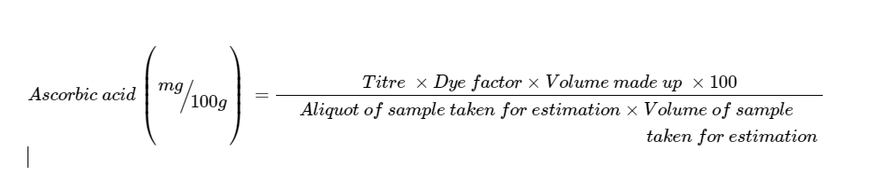

Materials required 

* Analytical balance 
* Beaker 
* Burette
* Conical flasks 
* Measuring cylinders 
* Ascorbic acid standard solution 
* DCPIP dye solution  
* Metaphosphoric acid solution 
* Juice samples- Apple, Mousami, Lemon and Amla 

Methods 

**Standardization of Dye**

1. Arrange all the prepared reagent solutions and test samples on the table. 
2. Add 5 ml ascorbic acid standard solution to each flask.  
3. Add 5 ml of HPO3 solution in the conical flask 
4. Fill the burette with the DCPIP dye solution and record the initial burette reading.  
5. Place the conical flask under the tip of the burette.  
6. Slowly add DCPIP dye solution to standard ascorbic acid solution until pink color appears which persists for 15s. 
7. Record final burette reading and calculate the dye factor using this formula: 

**Analysis of Juice Samples**

1. Select the sample and take out 50 ml juice in four different conical flasks marked as J1, J2, J3, J4. 
2. Heat the J2, J3, J4 sample at 60°C, 75°C and 90°C, respectively, 
3. Pipette out 10 ml juice from each sample flask and pour to the four different conical flask 
4. Add 90 ml of 3% HPO3 solution in each conical flask 
5. Titrate each sample with DCPIP dye solution until pink color appears which persists for 15s. 
6. Record the initial and final readings to get the amount of dye used for each titration.  
7. Calculate the Ascorbic acid (mg/100gm) using the following equation: 

