## Storyboard (Round 2)

Experiment 1: Determination of heat stability of vitamin C 

### 1. Story Outline:

This experiment involves first of all standardization of DCPIP dye and then preparing juice sample by extraction and then heating three juice samples and different temperatures  60°C, 75°C and 90°C using hot plate. Then 90 ml of 3% HPO3 solution in each conical flask (fresh & three heated samples) is added. To complete the experiment, titration of the sample is desirable which starts with addition of DCPIP dye to burette and continue till faint pink color appears. After that, volume of titrant used is recorded. Then on the basis of obtained data vitamin C content in terms of ascorbic acid (mg/100 gm) is calculated. Then comparison and analysis of result is done to determine heat stability of vitamin C. 

The main objective of this experiment is to determine heat stability of vitamin C. During the operation student will be able to relate and learn new concepts as well as able to experiment with different methods and evaluate vitamin C content in various juice samples. Further based on the results, user will be able to analyze and predict about analyze heat stability of vitamin C. 

### 2. Story:

First users will get themselves familiar with the experimental set-up and then select the desired standard ascorbic acid solution and DCPIP dye to standardize the dye for its further use. Then user will extract juice using electronic juicer, and make four samples J1, J2, J3 and J4. After this, user will heat the J2, J3, J4 sample at 60°C, 75°C and 90°C, respectively by keeping them on hot plate. Now user will add HPO3 solution in each conical flask. User will fill the burette with standardized DCPIP dye solution and start titration of sample by opening knob of burette. User will observe the color change and once it is faint pink color, user will stop the process by closing knob of burette. User will record the volume of titrant and use it for calculation. After calculation and results, user can analyze the data and predict the heat stability of vitamin C.  

#### 2.1 Set the Visual Stage Description:

In the simulator user will be able to see the virtual prototype of experimental set up resembling the actual experimental set up that is present in real time labs. For standardization of dye set up consists of 5 ml ascorbic acid standard solution 5 ml HPO3. The titration set up consisting DCPIP dye in burette will be used to determine the end point by titrating ascorbic acid standard solution. For juice sample analysis, electronic juicer is used to extract juice and strained with heplp of strainer. 4 different samples which are fresh, 3 samples heated at 60°C, 75°C and 90°C are available. A hot plate is there to heat samples at different temperatures during experiment. The burette setup will be used for the titration process with standardized DCPIP dye and titration is done to reach end point.  

#### 2.2 Set User Objectives & Goals:

1. The prime object of this experiment is to determine analyze heat stability of vitamin C. 
2. User will be able to understand the concept of standardization of dye. 
3. User will be able to experiment with titration method to estimate vitamin C content in juice samples. 
4. User will be able to analyze effect of temperature on vitamin C content of juice. 

#### 2.3 Set the Pathway Activities:

1. User will get familiar with all experimental setups and materials/reagents used. 
2. For standardization of DCPIP dye, user will take the ascorbic acid standard solution in conical flask and fill the burette with DCPIP dye. 
3. User will drag the conical flask under burette filled with DCPIP dye and press ‘Open knob’ Tab of the burette. 
4. Simulator will display the titration process and change in color of sample to faint pink as per steps. 
5. Once titration is completed, user will press ‘Calculation’ Tab for calculating dye factor. 
6. Next for analysis of juice sample, user will extract juice using electronic juicer. 
7. Then, make 4 different juice samples available. This all will be recognized by user as each have naming in the set up as J1, J2, J3 and J4. 
8. User will heat J2, J3, J4 sample at 60°C, 75°C and 90°C, respectively by keeping on hot plate one by one. 
9. Then click to add 90 ml of 3% HPO3 solution in each sample conical flask 
10. User will place the sample conical flask under burette having standardized DCPIP dye and press ‘Open knob’ Tab of the burette. 
11. Simulator will display the titration process and change in color of sample as per steps. 
12. 1Once titration is completed, user will press ‘Observation table’ and ‘Result & calculation’ Tab. 
13. Simulator will provide the result after calculation based on observed data. 
14. By analyzing result values of vitamin C content, user will be able to know the effect of temperature on vitamin C content of juice samples. 

##### 2.4 Set Challenges and Questions/Complexity/Variations in Questions:

Difficulty level: Remember (LO1) 

1. The loss of ascorbic acid from fruits cause ………………of fruits 

    <b>a) Non-enzymetic browning</b>  
    b) Ripening   
    c) Shrinkage       
    d) No effect 

2. In the presence of oxygen, ascorbic acid is degraded to form 

    a) Monocation     
    <b>b) Dehydroascorbic acid</b>    
    c) Peroxides    
    d) Ascorbate 

Difficulty level: Understand (LO2) 

3. Titrant used in estimation of vitamin C 

    <b>a) Indophenol dye solution</b>     
    b) Hydrochloric acid     
    c) Metaphosphoric acid    
    d) Acetic acid 

Difficulty level: Apply (LO3) 

1. DCPIP solution in the titration act as  
    
    <b>a) Oxidizing agent</b>   
    b) Reducing agent  
    c) Coloring agent  
    d) Neutralizing agent  

Difficulty level: Analyse (LO4) 

1. Which of the following fruit juice have higher vitamin C content 

    a) Apple juice   
    b) Mousami juice   
    c) Lemon juice   
    <b>d) Amla juice</b> 

Difficulty level: Evaluate (LO5) 

1. Which of the following sample have higher vitamin C content 

    <b>a) Fresh juice sample</b>  
    b) Juice treated at 60°C   
    c) Juice treated at 75°C  
    d) Juice treated at 90°C  

##### 2.6 Conclusion:

User will take approximate 5-7 minutes for understanding the procedure. Then for generating data by the help of simulator will take 8-10 minutes. After onwards for calculating result will take 2-3 minutes. Hence, total time taken for doing experiment will be approximately 15-20 minutes. 

##### 2.7 Equations/formulas: NA

### 3. Flowchart 4
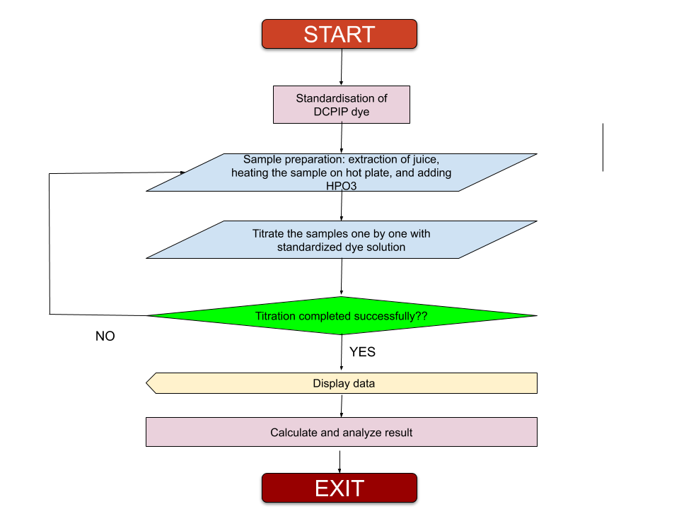
 
 

### 4. Mindmap:
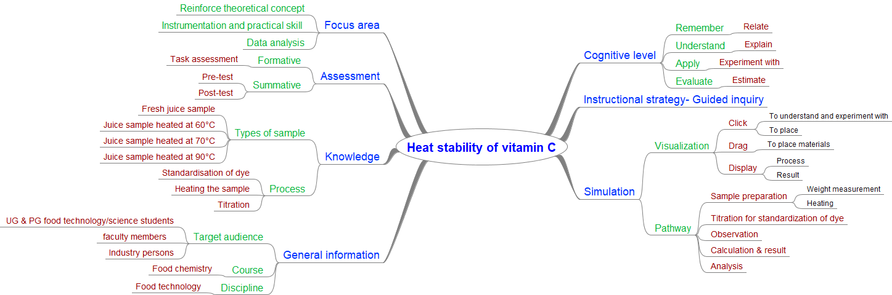
 
 

### 5. Storyboard :

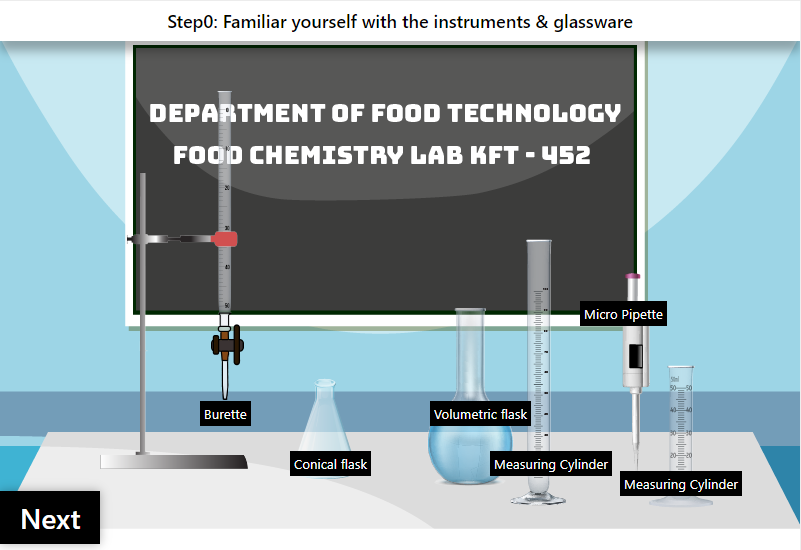
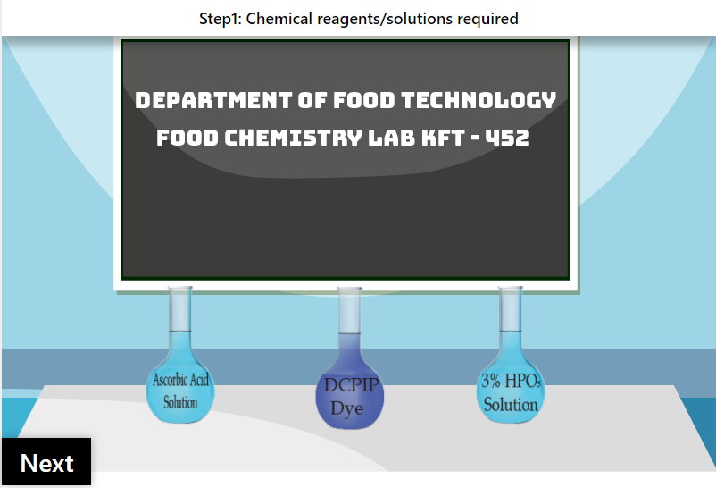
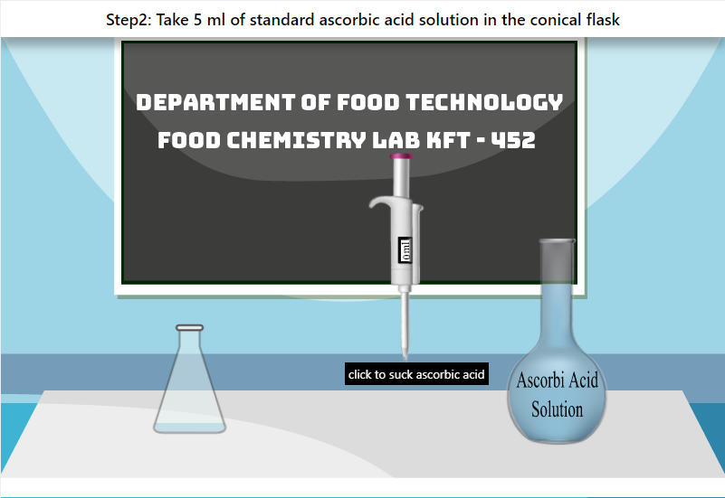
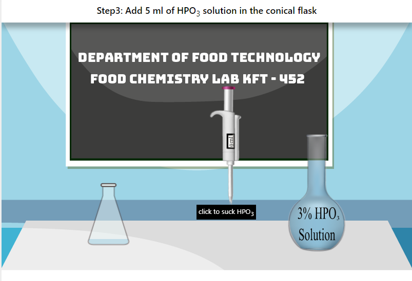
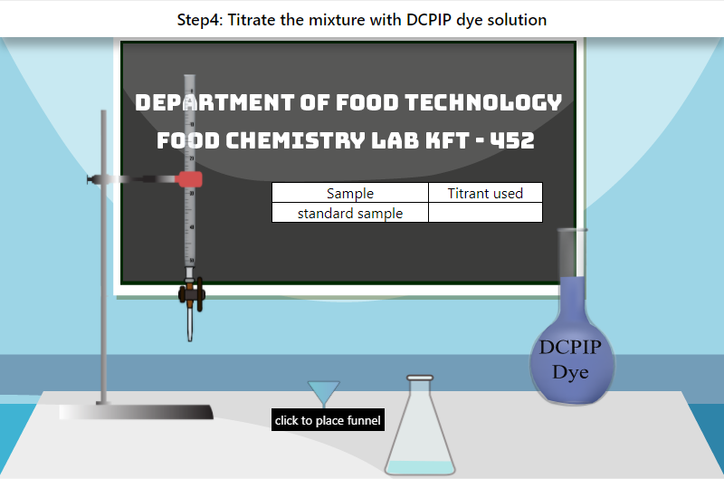
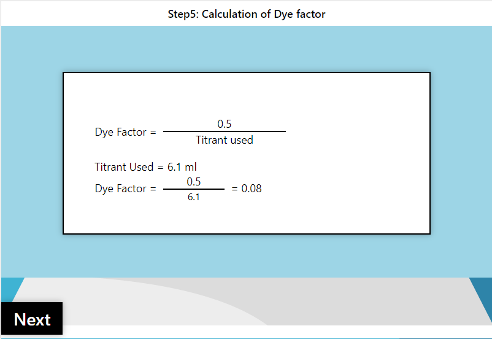
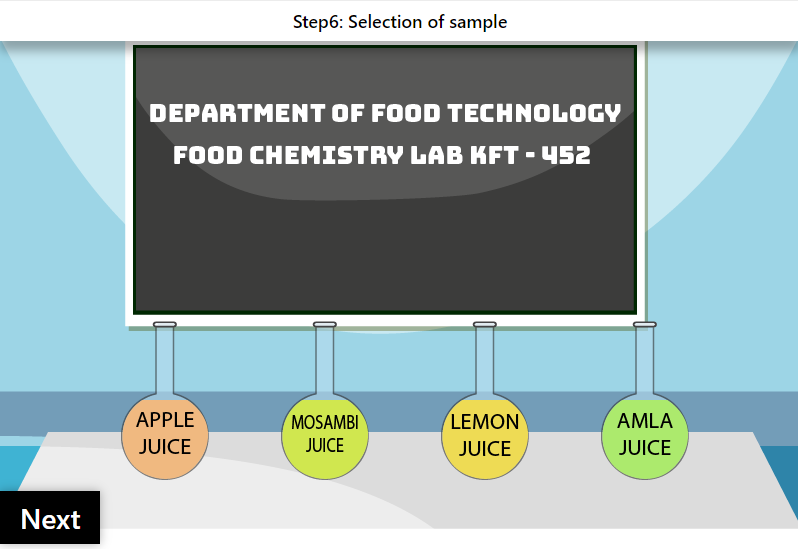
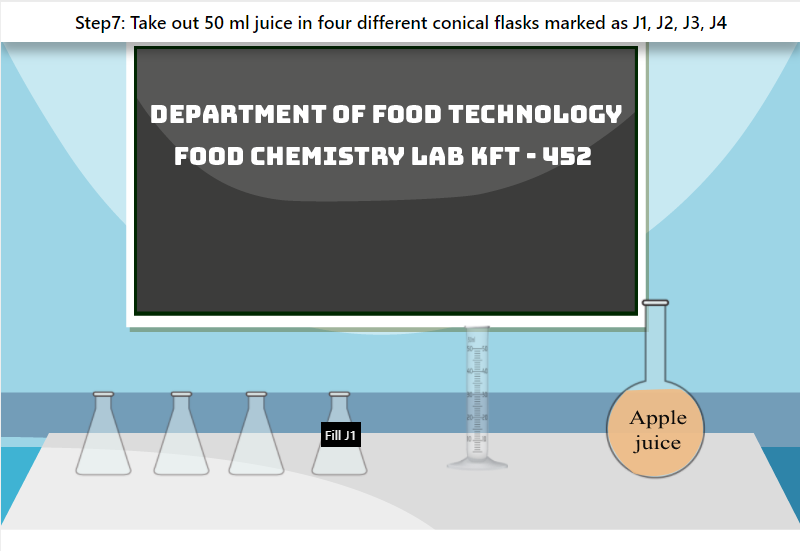
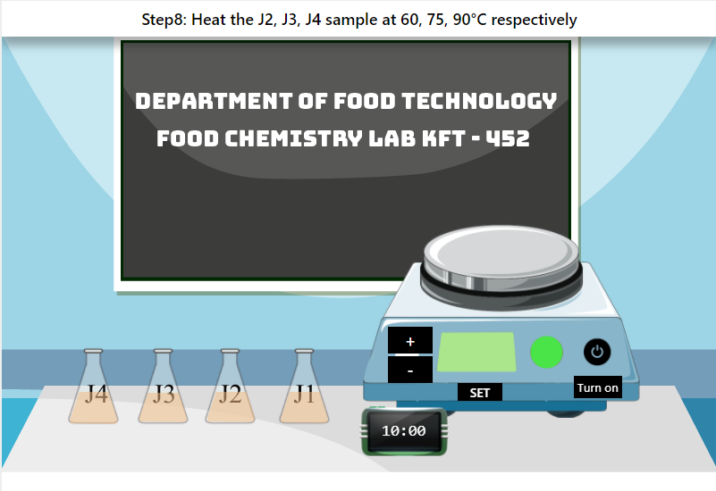
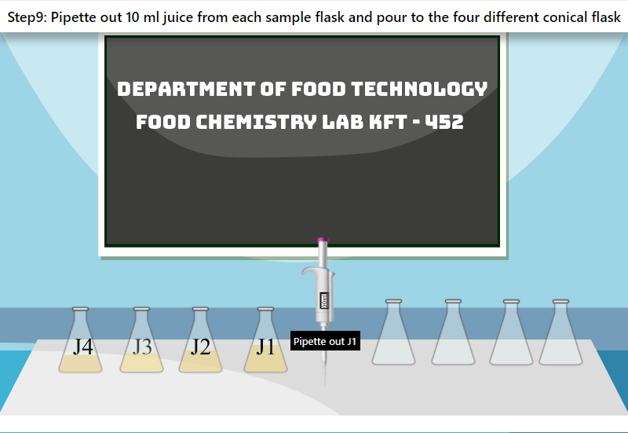
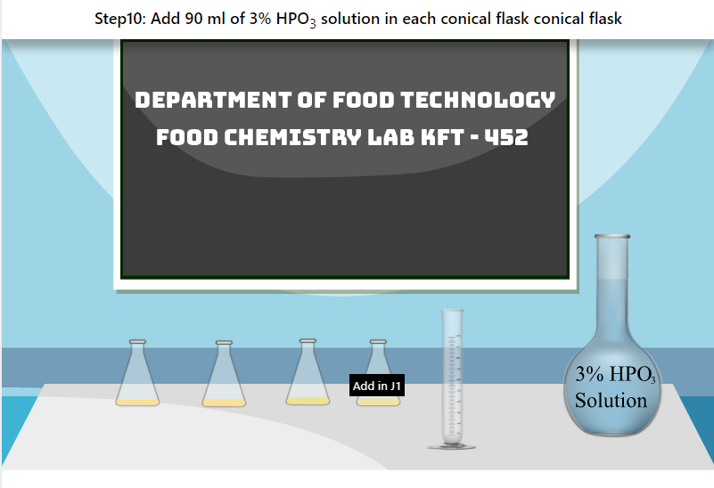
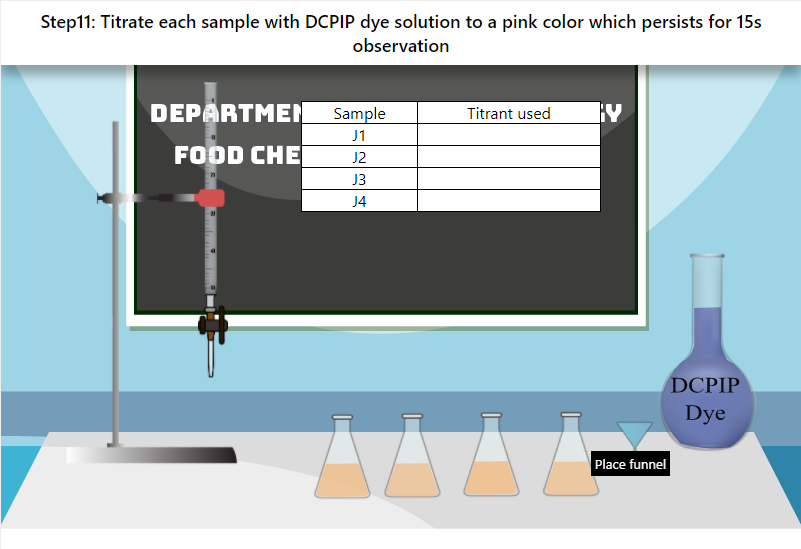

